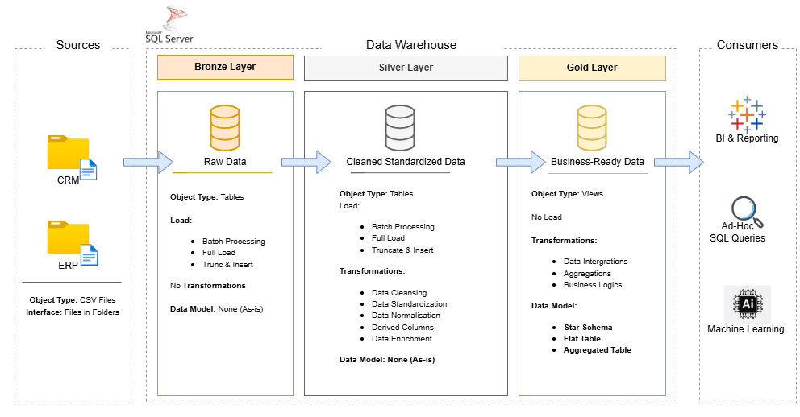

# Modern Data Warehouse & Analytics Project

Welcome to the **Data Warehouse and Analytics Project repository!** 🚀

Built following industry best practices in data engineering and analytics, this project delivers a comprehensive data warehousing solution — from architecting the warehouse to generating actionable business insights. Designed with production standards in mind, it reflects real-world data engineering and analytics workflows.

If you'd like, I can also make it more executive-level or more recruiter-focused.

---

## 🏗️ Architecture Overview

This solution implements the **Medallion Architecture**, structured into three transformation layers:


### 🥉 Bronze Layer — Raw Ingestion  
- Stores source data in its original format  
- Data ingested from ERP and CRM CSV files  
- Preserves raw integrity for traceability and auditing  

### 🥈 Silver Layer — Cleansed & Standardized  
- Data cleansing and validation  
- Standardization of formats and naming  
- Deduplication and business rule enforcement  
- Data normalization to ensure analytical consistency  

### 🥇 Gold Layer — Business-Ready Analytics  
- Dimensional modeling (Star Schema)  
- Fact and dimension tables optimized for reporting  
- Structured for performance and analytical scalability  

---

## 📌 Project Scope

This project delivers an end-to-end analytics pipeline including:

- Modern Data Warehouse Design
- ETL Development in SQL Server
- Dimensional Data Modeling
- SQL-Based Analytical Reporting
- Data Quality Enforcement
- Clear Technical Documentation

---

## 🚀 Project Objectives

### 1️⃣ Building the Data Warehouse (Data Engineering)

#### Objective
Develop a modern data warehouse using SQL Server to consolidate sales data, enabling analytical reporting and informed decision-making.

#### Specifications
- **Data Sources**: Import data from two source systems (ERP and CRM) provided as CSV files.
- **Data Quality**: Cleanse and resolve data quality issues prior to analysis.
- **Integration**: Combine both sources into a single, user-friendly data model designed for analytical queries.
- **Scope**: Focus on the latest dataset only; historization of data is not required.
- **Documentation**: Provide clear documentation of the data model to support both business stakeholders and analytics teams.

---

### 2️⃣ BI: Analytics & Reporting (Data Analysis)

#### Objective
Develop SQL-based analytics to deliver detailed insights into:
- **📊 Customer Behavior eg. purchasing power**
- **📦 Product Performance**
- **📈 Sales Trends & growth patterns**
- **💰 Revenue distribution insights**

This enables data-driven decision-making for stakeholders.

---

## 📂 Repository Structure
```
data-warehouse-project/
│
├── datasets/                           # Raw datasets used for the project (ERP and CRM data)
│
├── docs/                               # Project documentation and architecture details
│   ├── dwh_architecture.drawio        # Draw.io file shows the project's architecture
│   ├── data_catalog.md                 # Catalog of datasets, including field descriptions and metadata
│   ├── data_flow.drawio                # Draw.io file for the data flow diagram
│   ├── naming-conventions.md           # Consistent naming guidelines for tables, columns, and files
│
├── scripts/                            # SQL scripts for ETL and transformations
│   ├── bronze/                         # Scripts for extracting and loading raw data
│   ├── silver/                         # Scripts for cleaning and transforming data
│   ├── gold/                           # Scripts for creating analytical models
│
├── tests/                              # Test scripts and quality files
│
├── README.md                           # Project overview and instructions
├── LICENSE                             # License information for the repository
├── .gitignore                          # Files and directories to be ignored by Git
└── requirements.txt                    # Dependencies and requirements for the project
```
---
## ☕ Stay Connected

Let's stay in touch! Feel free to connect with me on the following platforms:
[](https://www.linkedin.com/in/musebe-ivan/)
___

## 🛡️ License
This project is licensed under the [MIT License](LICENSE). You are free to use, modify, and share this project with proper attribution.